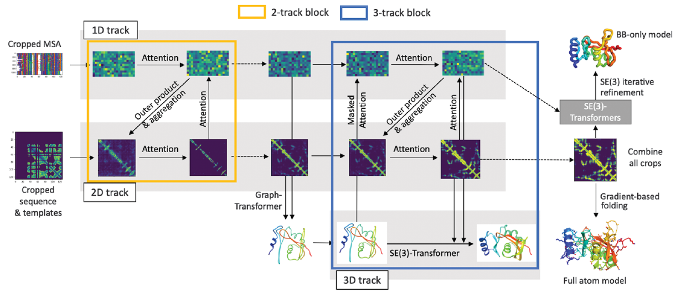

# rosettafold-pytorch (wip)

[](https://github.com/Lightning-AI/lightning)



An unofficial re-implementation of RoseTTAFold, a three-track deep learning model for protein structure prediction.

## Installation

```bash
pip install rosettafold-pytorch
```

## Usage

```python
import torch
from rosettafold-pytorch import RoseTTAFold

model = RoseTTAFold()
(WIP)
```

## Citation
```bibtex
@article{baek2021accurate,
  title={Accurate prediction of protein structures and interactions using a three-track neural network},
  author={Baek, Minkyung and DiMaio, Frank and Anishchenko, Ivan and Dauparas, 
    Justas and Ovchinnikov, Sergey and Lee, Gyu Rie and Wang, Jue and Cong, 
    Qian and Kinch, Lisa N and Schaeffer, R Dustin and others
  },
  journal={Science},
  volume={373},
  number={6557},
  pages={871--876},
  year={2021},
  publisher={American Association for the Advancement of Science}
}
```